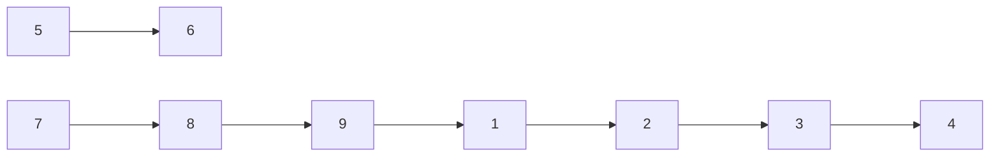

---
aliases:
  - 바이러스
cdate: "2022-08-24T12:18:03"
vdate: 
  - "2022-08-24T12:18:03" # Created
boj_link: https://www.acmicpc.net/problem/2606
solve_times:
  - ["2022-08-24T12:18", "2022-08-24T12:25"]
  - ["2022-08-24T13:05", "2022-08-24T14:05"]
  - ["2022-08-24T14:05", "2022-08-24T14:38"]
---

# 2606

## 소요시간

- 풀이 작성 및 풀이 완료까지 총 **100분** 소요

## 문제 독해

- 웜 바이러스는 네트워크를 통해 전파되며, 한 컴퓨터가 웜 바이러스에 걸리면 네트워크 상에 연결된 모든 컴퓨터가 웜 바이러스에 걸린다. 
    - 예를 들어, 1, 2, 3, 5, 6 번 컴퓨터가 연결되어 있고, 4, 7번 컴퓨터가 또 따로 연결되어 있는데 1번 컴퓨터가 웜 바이러스에 걸리면 1, 2, 3, 5, 6번 컴퓨터에만 웜 바이러스가 전파된다.
- 컴퓨터의 수와 네트워크 연결 정보가 주어질 때, 1번 컴퓨터를 통해 웜 바이러스에 걸리게 되는 컴퓨터의 수를 출력하라.

## 알고리즘 생각

그래프 탐색 문제인 것 같다. 정말 오래 전에 배워서 이름만 기억나는….
- 우선 이 컴퓨터간의 네트워크를 담을 자료구조에 대해서 생각해 보았다. *무방향 그래프* 인 것 같은데, 이걸 구현해보려고 한다.
    - [\[Algorithm\] C++에서 그래프 구현하기/TWpower's Tech Blog](https://twpower.github.io/72-implement-graph-in-cpp)
    - 2차원 배열에 그래프간 연결을 표현하려고 했는데 이러면 Sparse Matrix가 되어 메모리 낭비가 일어날 것이 뻔하기 때문에 다른 방법을 일단 생각해 보았다.
    - [Graph, 그래프, 자료구조\[CPP\]/노는 게 제일 좋아](https://luv-n-interest.tistory.com/1023)
        - 연결 리스트로 구현이 가능하다고 한다.

자료 조사 후 컴퓨터 네트워크를 무방향 그래프로 표현하고, 구현은 링크드 리스트로 하기로 했다.
링크드 리스트로 구현했을 때 그래프 탐색에 DFS, BFS를 사용했을때 시간복잡도 $O(V+E)$가 보장되기 때문이다. 
- [\[C++ Algorithm\] Graph - BFS : Breadth-Frist Search (너비 우선 탐색)/while(true){continue;}](https://m42-orion.tistory.com/m/64)
- [\[C++ Algorithm\] Graph - DFS : Depth-Frist Search (깊이 우선 탐색)/while(true){continue;}](https://m42-orion.tistory.com/m/63)

알고리즘은 그러니까 크게 두 부분으로 이루어진다.
1. 데이터 저장: 그래프에 네트워크 표현
2. 탐색: ID가 `1`인 그래프를 시작으로 탐색하여, 만나는 모든 노드의 숫자를 리턴

### 1. 네트워크 표현

- 이중 벡터로 연결 리스트를 표현한다. (`<list>`를 이용하는 방법은 나중에 해보자)
- `vector<vector<int>> Network`이며, 컴퓨터는 인덱스와 값으로 표현되기에 통일을 위해 1번 컴퓨터는 0이라는 값으로 매핑 하도롱 한다.
    - `Network[i]`은 `i`번 컴퓨터에 연결되어 있는 컴퓨터의 인덱스를 저장하고 있는 `vector<int>`이다.
- 그리고, 방문한 컴퓨터를 담을 벡터인 `vector<int> corrupted`를 선언해, 감염된 컴퓨터의 인덱스를 저장한다.

### 2. DFS 탐색 구현

- 최단 경로로 그래프를 탐색할 필요가 없이 메모리를 아끼기만 하면 되므로 DFS로 구현하려고 한다.
- 프로토타입은 아마 이럴 것이다: `void DFS (vector<vector<int>> network, vector<int> corrupted, int start=1);`
- `network`그래프를 `start` 인덱스에서부터 시작하여 탐색해, 방문한 노드의 인덱스를 `corrupted`에 저장한다.
- DFS 알고리즘은 아래와 같다.
    1. `start`를 `corrupted`에 추가한다. (시작 노드는 무조건 감염된 것이므로)
    2. 현재 노드와 인접한 노드 (`network[start]`의 원소들)를 반복문을 통해 하나씩 접근한다. 해당 노드들을 `next_node`로 설정한다.
    3. `next_node`가 `corrupted`에 있는가 확인한다.
        - 있다면 방문할 필요가 없으므로 `continue`한다.
        - 없다면 다시 `DFS(next_node)`를 호출한다.
    4. 1 ~ 4를 더이상 방문할 노드가 없을 때까지 반복한다.

## 구현

구현을 한 후 예제까지 정답을 내는 데에는 성공하였다. 하지만 제출을 *틀렸습니다* 가 나와서 약간 당황했다.  
고민하다가 질문을 검색해 봤고, [반례 아무리 찾아도 모르겠습니다/alstjrdl0303](https://www.acmicpc.net/board/view/89873)에서 다음과 같은 반례를 발견했다.

```text
10
7
1 2
2 3
3 4 
5 6
7 8
8 9
9 1
```



정답은 `6` 이 나와야 하지만, 내 코드로는 4가 나왔다. 디버그를 해보면 1, 2, 3, 4번째 노드까지만 탐색했다.
이유는 간단했는데, `Network` 자료 구조에 나는 입력을 항상 다음과 같이 저장해두었다.

```text
1 | 2
2 | 3
3 | 4
4 |
5 | 6
6 |
7 | 8
8 | 9
9 | 1
```

내 코드로는 9번 컴퓨터에서 1번 컴퓨터에 접근할 방법이 없었다. 시작점인 1번에서 1 → 2 → 3 → 4 까지 돌아온 후 `DFS`의 재귀가 차례대로 종료되고 함수가 결국 종료된다.

때문에 연결 상태를 확실히 기록하기 위해 `Network`를 새로고침 하는 함수 `makeFullGraph`를 만들었고, 해당 함수로 `Network`를 한 번 고치면 아래와 같은 상태가 되도록 만들었다.

```
1 | 2, 1
2 | 3, 1
3 | 4, 2
4 | 3
5 | 6
6 | 5
7 | 8
8 | 9, 7
9 | 1, 8
```

이렇게 연결 관계를 모조리 명시해 주면, 1번 컴퓨터에서 9번 컴퓨터에 접근할 수 있게 된다. 

**(?) 이거 상당히 중요한 개념인 것 같은데, 이걸 뭐라고 부르는지 모르겠다.**

## 최종 소스 코드

```cpp
#include <iostream>
#include <vector>
#include <algorithm>

using namespace std;

void DFS (vector<vector<int>> network, vector<bool> &corrupted, int start=0) {
    corrupted[start] = true;
    for (int next_comp: network[start]) {
        if (corrupted[next_comp] == false) {
            DFS(network, corrupted, next_comp);
        }
    }
}

void makeFullGraph (vector<vector<int>> &network) {
    for (int i = 0; i < network.size(); i++) {
        for (int e: network[i]) {
            // if network[e] doesn't have i
            if (find(network[e].begin(), network[e].end(), i) == network[e].end()) {
                network[e].push_back(i);
            }
        }
    }
}

int main (void) {
    int COMP_NUM; // (COMP_NUM <= 100)
    cin >> COMP_NUM;
    vector<bool> Corrupted (COMP_NUM, false);
    vector<vector<int>> Network (COMP_NUM);

    int COMP_PAIR_NUM;
    cin >> COMP_PAIR_NUM;

    for (int i = 0; i < COMP_PAIR_NUM; i++) {
        int comp, linked;
        cin >> comp >> linked;
        Network[comp - 1].push_back(linked - 1);
    }

    makeFullGraph(Network);

    DFS(Network, Corrupted);

    int ans = 0;
    for (auto e: Corrupted) {
        if (e) {
            ans++;
        }
    }

    cout << ans - 1 << endl;

    return 0;
}
```

## 추가적으로 찾아본 것 및 더 알아볼 것
- BFS & DFS 관련하여 기억이 잘 안 났는데 아래 두 링크가 정말 큰 도움이 되었다. 시간을 내서 정독할 것.
    - [\[C++ Algorithm\] Graph - BFS : Breadth-Frist Search (너비 우선 탐색)/while(true){continue;}](https://m42-orion.tistory.com/m/64)
    - [\[C++ Algorithm\] Graph - DFS : Depth-Frist Search (깊이 우선 탐색)/while(true){continue;}](https://m42-orion.tistory.com/m/63)
- 벡터 컨테이너에서 해당 원소가 있는지 없는지 확인하는 알고리즘을 어떻게 STL스럽게 구현하는지 궁금했다.
    - [check if a `std::vector` contains a certain object? \[duplicate\]/Stackoverflow](https://stackoverflow.com/questions/3450860/check-if-a-stdvector-contains-a-certain-object)
        - 아직 이터레이터는 파이썬만 익숙하다 … 더 공부할 필요가 있다.
- 위 문제를 다르게 풀 방법이 4가지 정도 생각난다.
    - DFS가 아니라 BFS로 구현하기. (무엇이 더 문제 해결에 효과적인지 분석)
    - 그래프를 인접 행렬로 구현해 볼 것
    - 연결 리스트를 `vector`가 아닌  `list` 컨테이너를 사용해서 구현해 볼 것
        - [C++, STL list(리스트), 시퀀스 컨테이너/옷 좋아하는 개발자](https://m.blog.naver.com/vjhh0712v/221607805191)
        - [\[C++\] list container 정리 및 사용법/BlockDMask](https://blockdmask.tistory.com/76)
    - 내가 컨테이너를 새로 만들어 서 구현해 볼 것. (`class`혹은 `struct` 이용하여)
- 그래프 이론에 대해서 체계적으로 정리할 필요가 있다.
- C++ 문법 사소한 것. 레퍼런스 (`&`) 관련하여
    - [\[C++\] 함수에 vector 전달하기/so_유닠한 블로그](https://soyoonique.tistory.com/32)


