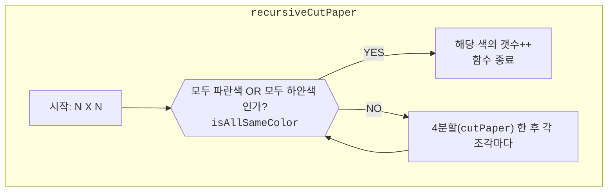

---
keyword:
  - Recursion
rank: S2
isFail: false
ddate: 2022-09-01
boj_link: https://www.acmicpc.net/problem/2630
solve_times:
  - [2022-09-01T18:18, 2022-09-01T19:24]
  - [2022-09-01T19:55, 2022-09-01T20:31]
---

# 2630

## 소요시간

1시간 42분

## 문제 독해

여러 개의 정사각형으로 이루어진 종이가 하연색 또는 파란색으로 부분적으로 칠해져 있다.
전체 종이의 크기가 $N \times N$ ($N=2^k$, $k$는 1이상 7이하의자연수) 라면 종이를 자르는 규칙은 다음과 같다.

- 전체 종이가 모두같은 색으로 칠해져 있지 않다면
    - 똑같은 크기의 $\frac{N}{2} \times \frac{N}{2}$ 종이 4개로 나눈다. 나누어진 종이를 $I$, $II$, $III$, $IV$ 라고 했을때 각각에 대해서 처음부터 다시 판단한다.
- 이 과정을 잘라진 종이가 모두 같은색이거나 하나의 정사각형이 되어 더이상 자를 수 없을 때까지 반복한다.

입력으로 $N$과 정사각형칸의 색들이 주어질 때, 잘라진 하얀색 색종이와 파란색 색종이의 개수를 구하는 프로그램을 작성하시오.

입력으로는 다음과 같이주어진다.

---

$N$ ($N$은 2, 4, 8, 16, 32, 64, 128중 하나이다.)
$c_{0, 0}$ $c_{0, 1}$ $...$ $c_{0, N-1}$
$c_{1, 0}$ $c_{1, 1}$ $...$ $c_{1, N-1}$
$...$
$c_{N-1, 0}$, $c_{N-1, 1}$, $...$ $c_{N-1, N-1}$

---

## 알고리즘

기본적으로 재귀 함수이다.



모두 파란색인지 하얀색인지 검사하는 함수 `isAllSameColor`를 만들었다.
재귀는 `recursiveCutPaper` 함수에서 일어나는데, 2차원 배열을 4등분 하는 함수는 `cutPaper`함수이다.

## 소스코드

```cpp
#include <iostream>
#include <vector>
#define BLUE true
#define WHIT false

using namespace std;

typedef struct {
    int n_blue;
    int n_whit;
} Solution;

bool isAllSameColor (vector<vector<bool>> p) {
    bool start_color = p[0][0];
    for (int i = 0; i < p.size(); i++) {
        for (int j = 0; j < p[i].size(); j++) {
            if (start_color != p[i][j]) {
                return false;
            }
        }
    }
    return true;
}

vector<vector<vector<bool>>> cutPaper (vector<vector<bool>> p) {
    int N = p.size();
    int n = N / 2;
    vector<vector<vector<bool>>> result(4, vector<vector<bool>>(n, vector<bool>(n)));

    for (int i = 0; i < n; i++) {
        for (int j = 0; j < n; j++) {
            result[0][i][j] = p[i][j];
            result[1][i][j] = p[i + n][j];
            result[2][i][j] = p[i][j + n];
            result[3][i][j] = p[i + n][j + n];
        }
    }
    return result;
}

Solution recursiveCutPaper (vector<vector<bool>> &p) {
    static Solution s { 0, 0 };
    if (isAllSameColor(p) == false) {
        for (vector<vector<bool>> np: cutPaper(p)) {
            recursiveCutPaper(np);
        }
    } else if (isAllSameColor(p) == true) {
        if (p[0][0] == WHIT) {
            s.n_whit++;
        } else {
            s.n_blue++;
        }
    }
    return s;
}


int main (void) {
    int N;
    cin >> N;
    vector<vector<bool>> paper (N, vector<bool>(N));

    for (int i = 0; i < paper.size(); i++) {
        for (int j = 0; j < paper[0].size(); j++) {
            int input;
            cin >> input;
            paper[i][j] = ((input == 1) ? BLUE : WHIT);
        }
    }

    Solution s = recursiveCutPaper(paper);

    cout << s.n_whit << endl;
    cout << s.n_blue << endl;

    return 0;
}
```

# Reference

개시발 `for`문 탈출조건에서 오타가 있어서 세그멘테이션 폴트가 났는데 디버깅을 아무리 해도 찾아내질 못해서 1시간 넘게 끙끙댔다.
그리고 VSCode 디버거가 너무 느려서 `gdb`나 `lldb`를 써보려고 하는데 러닝커브가 너무 가팔라서 모르겠다.

## 참고한 것

- [C 언어 `static` 변수 (정적 변수)/프로그래밍공부중](https://m.blog.naver.com/PostView.naver?isHttpsRedirect=true&blogId=dd1587&logNo=221106199316)
