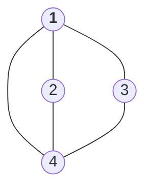
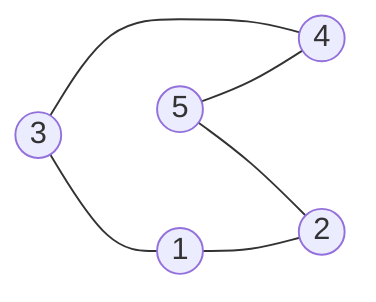
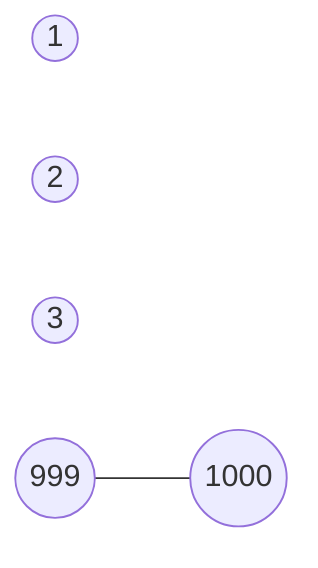

---
tags:
aliases:
  - DFS와 BFS
cdate: "2022-08-25T11:31:16"
vdate: 
  - "2022-08-25T11:31:16" # Created
boj_link: https://www.acmicpc.net/problem/1260
solve_times:
---

# 1260

## 문제 독해

그래프를 DFS로 탐색한 결과와 BFS로 탐색한 결과를 출력하는 프로그램을 작성하자.  
단, 아래와 같은 조건이 있다.

- 방문할 수 있는 정점이 여러개 인 경우에는, 정점 번호가 **작은 것**을 우선하여 방문한다.
- **더 이상 방문할 수 없는 경우** 종료한다.

탐색하려는 그래프의 특성은 아래와 같다.
- 어떤 두 정점 사이에 여러 개의 간선이 있을 수 있다. (다중 그래프이다.)
- 입력으로 주어지는 간선은 양방향이다. (무향 그래프이다.)

입력의 첫째 줄에는 다음과 같은 내용이 들어온다.
- `<정점의 개수 N> <간선의 개수 M> <탐색을 시작할 정점의 번호 V>`
- $1 \leq N \leq 1,000$, $1 \leq M \leq 10,000$ 를 만족한다.

입력의 다음 `M` 개의 줄에는 간선을 연결하는 두 정점의 번호가 주어진다.
- `<정점의 번호 u> <정점의 번호 v>`

출력의 첫 번째 줄에는 DFS를 수행한 결과를, 그 다음 줄에는 BFS를 수행한 결과를 출력한다. `<탐색을 시작할 정점의 번호 V>`부터 방문된 점을 순서대로 출력하면 된다.


## 알고리즘

어제의  [[2606|바이러스]]문제에서 나왔던 그래프 탐색을 아예 대놓고 요구하는 문제이다.

우선 가장 먼저 든 생각은 *그래프 $G(V,\ E)$를 어떤 방식으로 표현할 것인가* 이다.   

이 그래프의 특징을 다시 살펴보면
- 다중 그래프 (Multi Graph)
- 무향 그래프 (Undirected Graph)


때문에 문제에 봉착했다.  
구체적인 질문은 아래와 같다.

> **다중 그래프**는 어떻게 표현해야 하는가?

 조금 고민을 해봤는데, __문제에서 *다중* 그래프라는 것이 어떤 다른 결과를 초래하는지__ 모르겠다. 무향 그래프이고, 간선을 한 번만 방문하라는 명시도 없다.

혹시 몰라서 예제 입력들을 시각화 해보았다.

**예제 입력 1**

```text
4 5 1
1 2
1 3
1 4
2 4
3 4
```

인접 리스트 표현은 아래와 같다.

```text
1 | 2 3 4
2 | 1 4
3 | 1 4
4 | 1 2 3
```

그래프로 시각화하면 아래와 같다.



**예제 입력 2**

```text
5 5 3
5 4
5 2
1 2
3 4
3 1
```

인접 리스트 표현은 아래와 같다.

```text
1 | 2 3
2 | 5 1
3 | 4 1
4 | 5 3
5 | 4 2
```

그래프로 시각화하면 아래와 같다.



**예제 입력 3**

```text
1000 1 1000
999 1000
```

인접 리스트 표현은 아래와 같다.

```text
1    |
2    |
3    |
...
999  | 1000
1000 | 999
```

그래프로 시각화하면 아래와 같다.



문제를 아무리 다시 읽어봐도 **다중 그래프** 이기 때문에 발생하는 예외는 없기 때문에 단순 그래프로 치환하여 생각한다. 

정점인 $V$를 저장할 `vector<vector<int>> Vertices` 를 만들 것이다. 
예를 들어 `Vertices[i]`는 `i`번 정점에 연결되어 있는 $V$를 보관하고 있는 `vector<int>`타입의 컨테이너이다.

## 전체 소스 코드

```cpp
#include <iostream>
#include <vector>
#include <algorithm>

using namespace std;

class Graph {
private:
    vector<vector<int>> _edges;
    int _N;
    int _M;
    int _V;
    vector<int> _dfs_visited;
    vector<int> _bfs_visited;

private:
    void _DFS (int start) {
        this->_dfs_visited.push_back(start);
        for (int adj_v: this->_edges[start]) {
            if (this->isIn(this->_dfs_visited, adj_v)) {
                // case if visited
                continue;
            } else {
                // case if not visited
                this->_DFS(adj_v);
            }
        }

    }

    void _BFS (int start) {
        this->_bfs_visited.push_back(start);
        for (int adj_v: this->_edges[start]) {
            this->_bfs_visited.push_back(adj_v);
        }
        for (int adj_v: this->_edges[start]) {
            this->_BFS(adj_v);
        }
    }

    bool isIn (vector<int> vec, int key) {
        // return true if key is in vec
        return find(vec.begin(), vec.end(), key) != vec.end();
    }

public:
    /* Constructor */
    Graph (int n_ver, vector<vector<int>> edges) 
    : _N(n_ver) {
        this->_edges = edges;
    }


    /* Getter  */
    vector<int> getDFSVisited (int start) {
        this->_DFS(start);
        return this->_dfs_visited;
    }
    vector<int> getBFSVisited (int start) {
        this->_BFS(start);
        return this->_bfs_visited;
    }

};

int main (void) {
    int N, M, V;
    cin >> N >> M >> V;
    vector<vector<int>> edges (N);

    for (int i = 0; i < M; i++) {
        int u, v;
        cin >> u >> v;
        edges[u - 1].push_back(v - 1);
        edges[v - 1].push_back(u - 1);
    }

    for (auto &e: edges) {
        sort(e.begin(), e.end());
    }

    Graph graph(N, edges);

    vector<int> dfs_result = graph.getDFSVisited(V - 1);
    vector<int> bfs_result = graph.getBFSVisited(V - 1);

    for (auto e: dfs_result) {
        cout << e + 1 << " ";
    }
    cout << endl;
    /*
    for (auto e: bfs_result) {
        cout << e + 1 << " ";
    }
    */
    return 0;
}

```


# Reference

- [유방향 그래프와 무방향 그래프/MathWorks](https://kr.mathworks.com/help/matlab/math/directed-and-undirected-graphs.html)