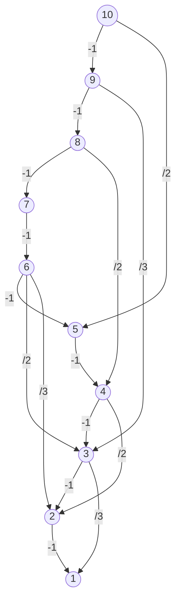

---
tags:
aliases:
  - 1로 만들기
cdate: "2022-09-02T13:00:04"
vdate:
  - "2022-09-02T13:00:04" # Created

rank: S3
isFail: true
ddate: 2022-09-02
boj_link: https://www.acmicpc.net/problem/1463
solve_times:
---

# 1463

## 소요시간

3시간: DFS로 방문한 경로를 모두 저장하고 싶었는데, 구현 실패하였다.
우울합니다...

## 문제 독해

정수 $X$에 사용할 수 연산은 다음의 3가지이다.
1. $X$가 $3$으로 나누어 떨어지면 → $3$으로 나눈다.
2. $X$가 $2$로 나누어 떨어지면 → $2$ 로 나눈다.
3. $1$을 뺀다.

정수 $N$이 주어졌을 때, 위와 같은 연산 세 개를 *적절히 사용해서* $1$을 만드려고 한다.  
연산을 사용하는 횟수의 **최솟값**을 출력하시오.  

- 입력의 첫째 줄: $N$ $(1 \leq N \leq 10^{6})$
- 출력의 첫째 줄: 연산을 하는 횟수의 최솟값

## 알고리즘

우선 눈여겨 볼 점은 3번 연산은 언제나 적용 가능하지만 1번, 2번 연산은 특정 조건(3으로 나누어 떨어지냐, 2로 나누어 떨어지냐)이 만족될 때에만 적용이 가능하다는 것이다.

때문에 어떤 숫자가 입력으로 들어오면, 그 숫자를 시드로 하여 *그래프* 를 만든 후 최소 깊이를 찾는 문제로 치환해 보았다.

예를 들어 숫자 10이 들어온다고 하면 다음과 같이 그래프가 구성될 것이다.



이를 위해서 들어온 숫자로 그래프를 만들어주는 함수 `makeGraph`를 만들 것이다.  
`makeGraph`는 정수형 숫자인 $N$을 받고, 연결 리스트로 구현된 그래프를 반환한다.  
연결 리스트는 이차원 벡터인 `vector<vector<int>>`로 구현할 것이다.  
예를 들어 10이 들어오면, 크기가 10인 이차원 벡터를 만들고, 각인덱스 별로 (인덱스 + 1)*(인덱스 자체가 아니다)* 에 대해서
- 1을 뺀 노드의 인덱스
- 2로 나누어 진다면 2로 나눈 노드의 인덱스
- 3으로 나누어 진다면 3으로 나눈 노드의 인덱스
에 대한 연결 관계를 추가한다.

예를 들어 10의 경우 연결 리스트는 아래처럼 될 것이다.

```text
9 | 8 7
8 | 7 2
7 | 6 3
6 | 5
5 | 4 2 1
4 | 3
3 | 2 1
2 | 1 0
1 | 0
0 |
```

방향 그래프이기 때문에 한쪽 방향만 생각해 주면 된다.
DFS를 하되, 목적지인 0번 인덱스에 도달한 경우에만 경로로 인정한다. (사실상 모든 경로가 0번 인덱스에 도달하므로 의미가 없는 조건이다.) DFS를 할 때마다 visited Node를 담는 배열을 설정하고, 전체 경로를 담는 새 배열에 0번에 방문할 때마다 푸쉬해준다.

그리고 마지막에 전체 경로를 담은 배열에서 최소 길이를 가진 배열을 구한 후 그 크기를 출력하면 될 것 같다.

## 소스코드

실패

# Reference

## 참고한 것

- [Tracing the Path in DFS, BFS, and Dijkstra's Algorithm/Baeldung cs](https://www.baeldung.com/cs/dfs-vs-bfs-vs-dijkstra)
- [DFS(깊이우선탐색) 이용한 가능한 모든 경로 구하기/범범스의 코딩 놀이터](https://bumbums.tistory.com/1)
- [[2606]]

## 더 하고싶은 것


